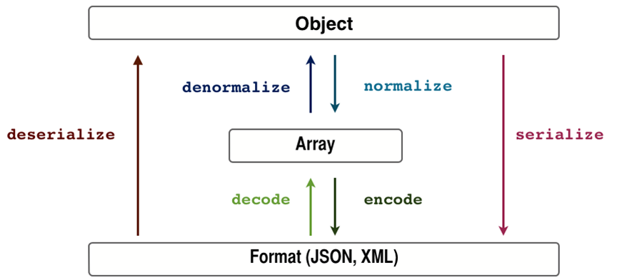

# Purpose

This is the complete documentation for how to use **rest-negotiator**. Please note that it may be trickier or more difficult to implement in the beginning. But it will feel more natural once you get used to it and its features.

**NOTE**: if you don't want to read this long documentation, you can check out the complete example which uses this library: [sobolan/rest-negotiator-example/](https://github.com/SoboLAN/rest-negotiator-example/). While it can be faster to copy bits-and-pieces from the example, I strongly recommend going through this document for a more in-depth understanding, **especially** if you intend to use the code in production systems.

# Prerequisites

## Symfony Serializer

**rest-negotiator** relies **heavily** on Symfony's Serializer component, which converts objects into arrays and arrays into objects. It then encodes/decodes them in/out of a specific format.

You can see a simple but incredibly complete representation of its workflow below:



For our purposes:

serializer = (n x transformers) + (m x encoders) working together

## Transformers

A **transformer** is a class which does normalization OR denormalization OR both (see the diagram above).

A key concept is the many-to-one relationship between a transformer and its associated class:

- a transformer knows how to do normalization/denormalization only for ONE class. For example: a transformer `UserTransformer` knows only how to handle `User` objects.
- a class can have multiple transformers associated with it (`UserTransformer`, `UserTransformer2` and so on). This will be a very useful feature for when we want to have different responses for different "version" parameters.

The term **transformer** is one of the most important concepts for effectively using **rest-negotiator**, so it's crucial to fully understand it.   

## Representations

A representation object is a simple data container, the basic skeleton for the future response body

The goal of a representation is to make sure that all data that is of the same type will be represented in the same way.

For example: in the case of list of entities, it makes sure that they always are under the `entities` key. This helps in having a more consistent API.

**rest-negotiator** contains a few representations and their corresponding transformers. Their use is of course optional.

Also, you can implement your own to fit your particular needs. They just have to be instances of `SoboLAN\RestNegotiator\Representation\RepresentationInterface`.

# Versioning a route

Now that we have a firm understanding about the serializer, transformers and representations, let's actually do some versioning.

## Defining default transformers

The default transformers are used when the API call does not include the necessary HTTP header or if the requested version simply does not exist. It's what the library will use as **fallback**.

So let's define a few simple transformers as services:

```yml
services:

    usertransformer:
        class: MyApp\Transformer\UserTransformer

    addresstransformer:
        class: MyApp\Transformer\AddressTransformer
```

Let's say that the above transformers correspond to the `User` and `Adress` classes, respectively. Also, to keep things close to real use-cases, let's say that the `Address` object **is stored inside** the `User` object.

Rules for defining transformers:

- They must implement the `SoboLAN\RestNegotiator\Transformers\SerializedClassInterface` interface. This is how the transformer **knows which class is associated with it**.
- The must implement either `Symfony\Component\Serializer\Normalizer\NormalizerInterface` or `Symfony\Component\Serializer\Normalizer\DenormalizerInterface` or both. This of course depends on your use-cases.
- Since `Address` is stored inside `User`, you should also have `UserTransformer` implement the `Symfony\Component\Serializer\SerializerAwareInterface` interface.

The great thing is that, since they're defined as services, you can inject whatever dependencies you want in them, in order to help with the normalization and/or denormalization.

Next, we need to save **the names** of the transformer services in a parameter (we will need them later):

```yml
parameters:

    myapp.transformers.default:
        - "usertransformer"
        - "addresstransformer"
```

## Defining additional transformers

In addition to the default transformers, we want to have additional ones, to be used for various versions:

```yml
services:

    usertransformer2:
        class: MyApp\Transformer\UserTransformer2

    usertransformer3:
        class: MyApp\Transformer\UserTransformer3

    addresstransformer2:
        class: MyApp\Transformer\AddressTransformer2
```

## Configuring transformers for each version

Each versioning configuration:

- is on a **per-route** basis
- is entirely **optional**
- is completely independent from the others (version "123" means something for route A, but it can mean something completely different for route B)

Let's take an example and explain it:

```yml
get_user:
    pattern: /user/{id}
    requirements:
        _method:  GET
    defaults:
        _controller: myapp.controller:getAction
        versions:
            2:
                transformers:
                    - "usertransformer2"
                    - "addresstransformer2"
            3:
                transformers:
                    - "usertransformer3" 
            default_version: 2
```

As you can see, we can define multiple versions for each route:

- under the `transformers` key, we will put the service names of the transformers to be used for that version
- under the `default_version` key (which is **optional**), we will put what version to be used by default if the user doesn't specify one or specifies an incorrect one. In our particular case, if we specify `default_version: 17`, then it will be **ignored** since version 17 doesn't exist.

> Note: In a future version of the library, there will be also be a `encoders` key under which various encoders (XML, JSON, HTML, YAML etc.) can be specified. For the moment however, this is not supported.

## How versioning is applied

The rule is (and this is **extremely important**):

**You specify for each version which transformers to be used IN ADDITION to the default ones. If the one you specify matches one that is already defined as default, it will overwrite the default one.**

Note: by "matches" I mean that they know how to normalize/denormalize the same class. This is why implementing the `SoboLAN\RestNegotiator\Transformers\SerializedClassInterface` interface is so important: because that is what is used to figure this stuff out.

Let's review our example:

| Entry                | Value                                                                                     |
|----------------------|-------------------------------------------------------------------------------------------|
| default transformers | "usertransformer" for the `User` class and "addresstransformer" for the `Address` class   |
| for version 2        | "usertransformer2" for the `User` class and "addresstransformer2" for the `Address` class |
| for version 3        | "usertransformer3" for the `User` class                                                   |
| default version      | "default_version" is 2                                                                    |

Below you will find a table that describes what transformers will be used in each case:

| Version asked by the user | Transformer used for User | Transformer used for Address |
|---------------------------|---------------------------|------------------------------|
| 1                         | usertransformer2          | addresstransformer2          |
| 2                         | usertransformer2          | addresstransformer2          |
| 3                         | usertransformer3          | addresstransformer           |
| 4                         | usertransformer2          | addresstransformer2          |


Understanding this sub-chapter is the core part of this documentation. If you get this right, then using **sobolan/rest-negotiator** will be like writing "Hello world" programs.

# Loading the library in your application

Require the library with composer:

```
"require": {
    ......
    "sobolan/rest-negotiator": "~1.0"
}
```

Load the bundle in `AppKernel`:

```php
public function registerBundles()
{
    $bundles = array(
        .....
        new SoboLAN\RestNegotiator\SoboLANRestNegotiatorBundle()
    );
}
```

Define the rest-negotiator main service:

```yml
services:

    myapp.negotiator:
        class: SoboLAN\RestNegotiator\Negotiator\RestNegotiator
        arguments:
            - '@request_stack'
            - '@sobolan.restnegotiator.serializer.factory'
            - '@sobolan.restnegotiator.version.parser'
            - '@sobolan.restnegotiator.format.parser'
            - '%myapp.transformers.default%'
            - '%sobolan.restnegotiator.encoders.default%'
```

> Note: the reason the library doesn't define this service and you have to is because the library has no knowledge of the last 2 dependencies.

Then inject the negotiator service in your controller:

```yml
services:

    myapp.controller:
        class: MyApp\DefaultController
        arguments:
            - '@myapp.negotiator'
```

Now, in your controller, all you have to do is enclose the object in the correct `Representation` object and pass it to `RestNegotiator::getResponse()`:

```php
public function getAction(Request $request)
{
    $user = $this->getTheUserObjectSomehow();

    return $this->negotiator->getResponse(new EntityRepresentation($user), Response::HTTP_OK);
}
```

That's pretty much it. Easy, right ?

For API calls that provide the objects in their body (like POST or PUT requests), you do something like this:

```php
public function createAction(Request $request)
{
    $userObject = $this->negotiator->getDeserialized(User::CLASS_NAME);

    return new Response('OK', Response::HTTP_OK);
}
```

where `User::CLASS_NAME` is the full name of the class (including namespace).

Exactly the same mechanisms and rules are applied here, except that in this case the library will work with the `Content-Type` header instead of `Accept`.

# Handling Sub-requests

You can safely use the library for sub-requests, it will work just fine.

This is because, internally, the library will load and unload the necessary transformers, according to the specified versions.